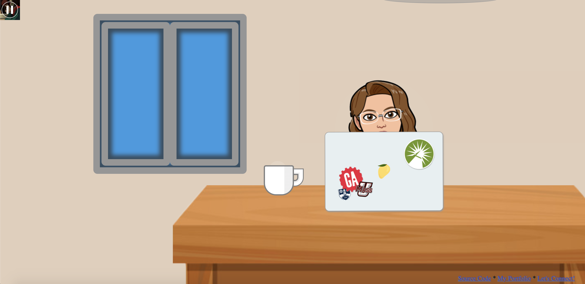
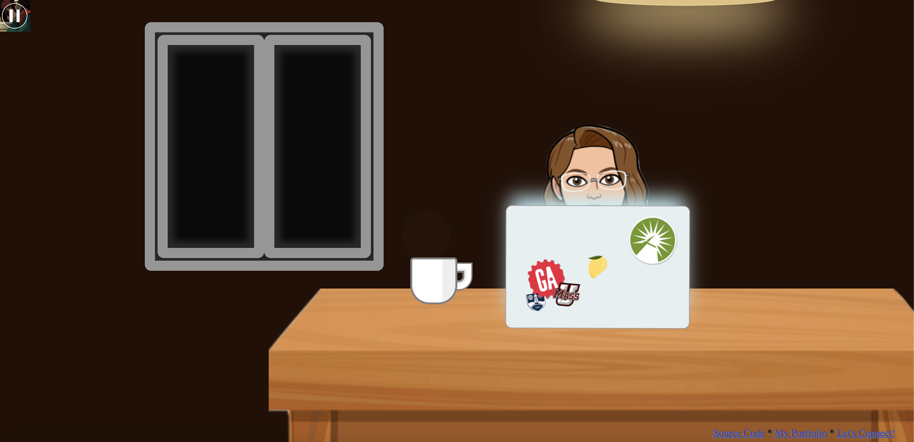

# CoderGirl Animation

## Project Description
A study-aide application for developers with an intricately animated interface and built entirely in vanilla HTML & CSS. The app also offers an embedded Spotify playlist.

The app was built in celebration of a professional milestone and as such the character is in my likeness and the app features homeage to the schools and institutions that helped me reach this goal :)

## App Screenshots

*"Daytime"*

*"Nightime"*

## Future Goals
In future iterations of this project I would like to...
* Turn this into a Pomodoro clock app or something similar to further build on the "study-aide" intention
* Offer users a way to customize the laptop decal and Bitmoji character to represent themselves or someone of their choosing! (Could have them simply upload replacement images, but making them adhere to my specs - or automating it so they need not - might be difficult)
* Offer "easter eggs" where the user clicking around the interface can trigger other animations?
* More animation! Careful not to crowd the view, but could be fun to... 
    * have a pet/child walk by
    * offer more facial expression/action from the character
    * have a more nuanced sunrise/sunset
    * have things pass by the window
